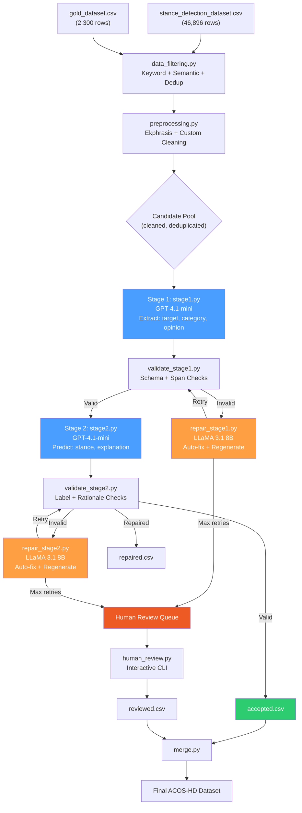

# ACOS-HD: LLM-based Schema-Constrained Generation Pipeline

**Aspect-Category-Opinion-Stance for Homelessness Discourse**

A two-stage LLM generation pipeline that produces structured ACOS-HD annotations following the paper *"Hobo, Not Hate: Fair and Explainable Aspect-Category-Opinion-Stance Modeling for Homelessness Discourse Analysis"*.

---

## Architecture Diagram



---

## Pipeline Components

| File | Description |
|------|-------------|
| `configs.py` | Centralized configuration: hyperparameters, schema definitions, model settings, paths |
| `data_filtering.py` | Keyword + semantic filtering from `stance_detection_dataset.csv`, dedup against gold |
| `preprocessing.py` | Text cleaning via ekphrasis: URL/hashtag/mention handling, spell correction, emoji substitution |
| `prompt_stage1.py` | Stage 1 prompt construction: structured extraction (aspect, category, opinion) |
| `prompt_stage2.py` | Stage 2 prompt construction: stance + rationale generation |
| `stage1.py` | Stage 1 generation via GPT-4.1-mini with cost tracking |
| `stage2.py` | Stage 2 generation via GPT-4.1-mini with cost tracking |
| `validate_stage1.py` | Schema validation, category normalization, span grounding checks |
| `validate_stage2.py` | Stance label validation, rationale grounding, label-consistency filtering |
| `repair_stage1.py` | Auto-fix + LLaMA 3.1 8B regeneration for Stage 1 failures |
| `repair_stage2.py` | Auto-fix + LLaMA 3.1 8B regeneration for Stage 2 failures |
| `data_constructor.py` | Main orchestrator: load → filter → clean → generate → validate → repair → save |
| `human_review.py` | Interactive CLI for reviewing failed samples |
| `merge.py` | Merge accepted + reviewed into final `generated_dataset.csv` |
| `inference.py` | Does inference on test.csv having text column and saves results inside `test_results.csv` |

---

## Setup

### 1. Environment

```bash
pip install -r requirements.txt
```

### 2. API Keys

Create `.env.local` in the project root:

```
OPENAI_API_KEY=sk-...
HF_TOKEN=hf_...
TWITTER_API=...
```

### 3. Required Data Files

- `stance_detection_dataset.csv` — Mixed dataset (PStance, COVID19, SemEval2016, VAST)
- `gold_dataset.csv` — Manually curated ACOS-HD gold standard
- `test.csv` — test samples to do inference on

### 4. Cloned Repos (already present)

- `gitclones/ekphrasis/` — Text preprocessing
- `gitclones/distributional-judge/` — LLM-as-judge utilities

---

## Usage

### Run Full Pipeline

```bash
# Default: 1000 samples per class (3000 total)
python data_constructor.py

# Custom sample count and budget
python data_constructor.py --samples-per-class 500 --budget 50.0

# Verbose logging
python data_constructor.py --log-level DEBUG
```

### Human Review

```bash
python human_review.py
```

Actions: `[a]ccept` · `[e]dit` · `[r]eject` · `[s]kip` · `[q]uit`

### Merge Results

```bash
python merge.py
```

### Do Sampling

```bash
python inference.py
```

---

## Configuration

All hyperparameters are controlled via `configs.py`. Key settings:

```python
from configs import get_config
cfg = get_config()

# Samples per stance class
cfg.pipeline.samples_per_class = 1000  # → 3000 total

# Budget
cfg.pipeline.total_budget_limit_usd = 100.0

# Filtering thresholds
cfg.filtering.keyword_min_matches = 1
cfg.filtering.semantic_similarity_threshold = 0.35
cfg.filtering.dedup_fuzzy_threshold = 85

# Model settings
cfg.model.annotation_model = "gpt-4.1-mini"
cfg.model.annotation_temperature = 0.3
cfg.model.validator_model_name = "meta-llama/Llama-3.1-8B-Instruct"

# Repair settings
cfg.pipeline.max_repair_retries = 3
```

---

## ACOS-HD Schema

### Aspect Categories (C)

| Category | Description |
|----------|-------------|
| Shelter & Housing | Physical living arrangements, temporary/permanent housing |
| Public Space | Shared urban spaces where homelessness is visible |
| Public Safety | Safety, hygiene, sanitation concerns |
| Addiction & Health | Substance use, mental health, healthcare access |
| Policy & Governance | Laws, enforcement, government responses |
| Employment & Economy | Work opportunities, economic impacts |
| Empathy & Support | Moral framing, dignity, compassion, stigma |
| Community Impact & Social Cohesion | Neighborhood relations, social coexistence |

### Stance Labels (Y)

| Label | Definition |
|-------|------------|
| **HATE** | Hostile, dehumanizing, exclusionary, or stigmatizing discourse |
| **NEUTRAL** | Descriptive, factual, or non-committal discourse |
| **HOPEFUL** | Supportive, empathetic, constructive, or solution-oriented discourse |

### Output Structure

```json
{
  "aspect_target": "<exact span from post>",
  "aspect_category": "<one of 8 categories>",
  "opinion_span": "<exact span from post>",
  "stance": "HATE | NEUTRAL | HOPEFUL",
  "explanation": "<minimal justifying span from post>"
}
```

---

## Validation Checks (Paper §3.6)

1. **Field completeness** — All required fields present
2. **Category validation** — `aspect_category ∈ C` with fuzzy normalization
3. **Stance validation** — `stance ∈ {HATE, NEUTRAL, HOPEFUL}` with alias mapping
4. **Span grounding** — `aspect_target` and `opinion_span` are exact substrings of the post
5. **Rationale grounding** — `explanation` is textually grounded (token-level F1 ≥ threshold)
6. **Label consistency** — Stance is consistent with opinion span valence

---

## Output Files

| File | Contents |
|------|----------|
| `outputs/accepted.csv` | Samples that passed all validations |
| `outputs/repaired.csv` | Samples fixed via auto-repair or LLaMA regeneration |
| `outputs/review_queue.csv` | Samples requiring human adjudication |
| `outputs/reviewed.csv` | Human-reviewed samples (from `human_review.py`) |
| `outputs/generated_dataset.csv` | Final merged dataset (from `merge.py`) |

---

## Cost Tracking

The pipeline logs per-sample and cumulative costs:

```
ACCEPTED #42 [HOPEFUL] cost=$0.0012 | Totals: {'HATE': 14, 'NEUTRAL': 13, 'HOPEFUL': 15} | Total cost=$0.0518
```

---

## Hardware Requirements

- **GPU**: T4 16GB VRAM (for LLaMA 3.1 8B 4-bit quantized validator)
- **RAM**: 16GB+ recommended
- **API**: OpenAI API key with GPT-4.1-mini access

---

## References

- Paper: *"Hobo, Not Hate: Fair and Explainable Aspect-Category-Opinion-Stance Modeling for Homelessness Discourse Analysis"*
- OATH-Frames (Ranjit et al., 2024)
- LLaMA 3.1 (Grattafiori et al., 2024)
- Distributional Judge (Wang et al.)
