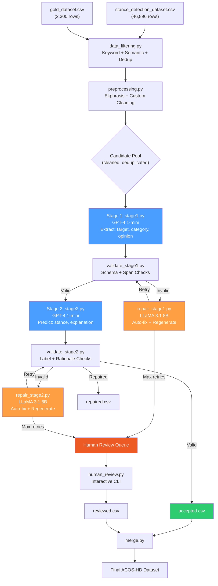

# ACOS-HD LLM-based Schema-Constrained Generation Pipeline

Build a complete 16-file pipeline for generating ACOS-HD (Aspect-Category-Opinion-Stance for Homelessness Discourse) annotations following the paper's schema-constrained, staged generation framework.

## Workspace Context

```
c:\Users\KIIT0001\Desktop\gitclones\acos-hd\
├── .env.local                          # OPENAI_API_KEY, HF_TOKEN
├── stance_detection_dataset.csv        # 46,896 rows (PStance, VAST, SemEval2016, COVID19)
├── gold_dataset.csv                    # 2,300 rows (existing gold annotations)
├── gitclones/
│   ├── ekphrasis/                      # Text preprocessing library (cloned)
│   └── distributional-judge/           # LLM-as-judge utilities (cloned)
└── [16 pipeline files to create]
```

**Source data** (`stance_detection_dataset.csv`): 46,896 rows with columns `dataset, id, text, target, stance, split`. VAST has ~3,296 keyword hits for homelessness/immigration terms.

**Gold data** (`gold_dataset.csv`): 2,300 rows with columns `id, text, aspect_category, aspect_span, opinion_span, stance, evidence_span`. Has some label noise (e.g. "Neural", "Haoe", "Employment &Economy" without space).

## User Review Required

> [!IMPORTANT]
> **Model Budget**: GPT-4.1-mini for annotation (~$0.0004/1K input, ~$0.0016/1K output tokens). At ~500 tokens/sample, generating 3,000 samples (1,000 per stance class) will cost approximately **$5–15** depending on repair loops. Confirm this is acceptable.

> [!IMPORTANT]
> **LLaMA 3.1 8B on T4 GPU**: Will use 4-bit GPTQ/AWQ quantization to fit in 16GB VRAM (~5GB model). Validation/repair inference will be local and free but slower (~2-5 sec/sample). This is used for validation/repair/regeneration only.

> [!WARNING]
> **Gold dataset has label noise**: Found typos like "Neural" (3), "Haoe" (1), "hate" (1), "Employment &Economy" (67 without space), "Community Impact and Cohesion" (28), " Shelter & Housing" (21 with leading space), "Addicton and Health" (1). The pipeline will normalize these during gold data loading for deduplication checks.

## Open Questions

> [!IMPORTANT]
> 1. **Sample count per class**: You mentioned "if I set 1000, collect 1000 for each class to a total of 3000." The 3 classes are HATE, NEUTRAL, HOPEFUL. Should I default to a smaller test value (e.g., 10 per class) in config for initial testing?
> 2. **Immigration scope**: You mentioned "covering up from the mixed dataset (especially VAST)" for "homeless and immigration". Should immigration-related posts also be annotated with homelessness aspect categories, or do you want a separate handling? The paper focuses on homelessness discourse only. I'll filter for posts relevant to homelessness AND immigration policy as it relates to housing/welfare.
> 3. **Urban Dictionary API**: Urban Dictionary has no official API. Should I use a scraping approach or a static slang dictionary (ekphrasis already has `noslang` dictionaries)? I'll default to ekphrasis's built-in slang dict + a curated supplementary dict.
> 4. **Twitter/URL resolution**: For URL parsing and Twitter mention resolution, do you have API keys for Twitter? Without them, I'll use basic HTTP GET for URLs and skip Twitter-specific resolution.

## Proposed Changes

### 1. Configuration Module

#### [NEW] [configs.py](file:///c:/Users/KIIT0001/Desktop/gitclones/acos-hd/configs.py)

Central configuration file exposing ALL hyperparameters. Organized into dataclass sections:

```python
@dataclass
class DataConfig:
    stance_dataset_path: str          # stance_detection_dataset.csv
    gold_dataset_path: str            # gold_dataset.csv
    output_dir: str                   # ./output/
    accepted_csv: str                 # accepted.csv
    repaired_csv: str                 # repaired.csv
    reviewed_csv: str                 # reviewed.csv
    cache_dir: str                    # ./cache/
    
@dataclass
class FilterConfig:
    # Keyword lists for homelessness/immigration relevance
    primary_keywords: list            # homeless, housing, shelter, encampment...
    secondary_keywords: list          # welfare, poverty, addiction, drug...
    immigration_keywords: list        # immigrant, immigration, refugee, asylum...
    min_keyword_hits: int = 1         # Minimum keyword matches to include
    use_semantic_similarity: bool     # Use sentence-transformers for relevance
    similarity_model: str             # all-MiniLM-L6-v2
    similarity_threshold: float       # 0.35
    datasets_to_sample: list          # ['VAST', 'PStance', 'COVID19', 'SemEval2016']
    vast_priority_weight: float       # 2.0 (oversample from VAST)
    
@dataclass  
class CleaningConfig:
    min_text_length: int = 20         # Minimum chars after cleaning
    max_text_length: int = 512        # Maximum chars
    resolve_urls: bool = True         # HTTP GET for important URLs
    url_importance_threshold: float   # 0.5 (based on surrounding context)
    resolve_hashtags: bool = True     # Unpack hashtags via ekphrasis
    resolve_mentions: bool = False    # Skip Twitter mentions (no API)
    fix_spelling: bool = True
    expand_abbreviations: bool = True
    substitute_emojis: bool = True
    remove_redundant: bool = True
    
@dataclass
class ModelConfig:
    # Annotation model (GPT-4.1-mini)
    annotation_model: str = "gpt-4.1-mini"
    annotation_temperature: float = 0.3
    annotation_max_tokens: int = 512
    annotation_top_p: float = 0.95
    
    # Validation/Repair model (LLaMA 3.1 8B Instruct)
    validator_model: str = "meta-llama/Llama-3.1-8B-Instruct"
    validator_quantization: str = "4bit"  # AWQ/GPTQ for T4
    validator_max_tokens: int = 512
    validator_temperature: float = 0.1
    validator_device: str = "cuda"
    
@dataclass
class PipelineConfig:
    samples_per_class: int = 10       # User sets: 1000 for production
    stance_classes: list              # ['HATE', 'NEUTRAL', 'HOPEFUL']
    max_validation_retries: int = 3
    max_repair_retries: int = 3
    batch_size: int = 5               # Concurrent API calls
    log_cost_per_sample: bool = True
    total_budget_limit: float = 50.0  # USD hard cap
    
@dataclass
class SchemaConfig:
    aspect_categories: list           # 8 categories from paper
    stance_labels: list               # HATE, NEUTRAL, HOPEFUL
    # Span-copy constraint threshold
    span_overlap_threshold: float = 0.6
    rationale_grounding_threshold: float = 0.5
```

---

### 2. Data Filtering Module

#### [NEW] [data_filtering.py](file:///c:/Users/KIIT0001/Desktop/gitclones/acos-hd/data_filtering.py)

Robust multi-stage filtering pipeline:

1. **Load once**: Load `stance_detection_dataset.csv` and `gold_dataset.csv` into memory once
2. **Keyword filtering**: Vectorized string matching using `str.contains()` with compiled regex for all keyword lists simultaneously
3. **Semantic similarity filtering**: Use `sentence-transformers/all-MiniLM-L6-v2` to encode all candidate texts, compute cosine similarity against homelessness reference sentences, threshold at configurable value
4. **Deduplication**: 
   - Hash-based exact dedup against gold_dataset texts
   - Fuzzy dedup using MinHash/LSH (datasketch) for near-duplicates
   - Rolling dedup: each accepted sample is added to the dedup set for subsequent checks
5. **Balanced sampling**: Sample proportionally across stance classes (FAVOR→HOPEFUL, AGAINST→HATE, NONE→NEUTRAL mapping) with VAST priority weighting
6. **Caching**: Cache filtered results to disk (pickle/parquet) with hash-based invalidation

Key design decisions:
- All keyword matching done via single vectorized pass with `np.column_stack` of boolean masks
- Sentence embeddings computed once in batch, cached to `.npy` files
- Gold dataset loaded once, text fingerprints stored in a `set` for O(1) lookup

---

### 3. Preprocessing Module

#### [NEW] [preprocessing.py](file:///c:/Users/KIIT0001/Desktop/gitclones/acos-hd/preprocessing.py)

Multi-step cleaning pipeline using ekphrasis + custom logic:

1. **Remove empty/deleted posts**: Filter `[deleted]`, `[removed]`, empty strings
2. **URL handling**: 
   - Classify URL importance by surrounding context keywords
   - High-importance: HTTP GET → parse HTML with BeautifulSoup → extract title/summary → substitute inline
   - Low-importance: remove
3. **Hashtag handling**: Ekphrasis `Segmenter` to unpack `#EndHomelessness` → `end homelessness`
4. **Mention handling**: Remove `@username` patterns (no Twitter API)
5. **Abbreviation/slang expansion**: 
   - Ekphrasis `noslang` dictionary
   - Custom supplementary dictionary for internet slang (curated from common patterns)
   - Acronym expansion for domain terms (PEH → people experiencing homelessness)
6. **Emoji/emoticon substitution**: `emoji` library → textual description, ekphrasis emoticon dict
7. **Spelling correction**: Ekphrasis `SpellCorrector` with twitter corpus
8. **Punctuation normalization**: Keep sentence-ending punctuation, remove excessive
9. **Repeated char/word/sentence removal**: 
   - Elongated words: ekphrasis handler (e.g., "sooooo" → "so")
   - Repeated words: regex `r'\b(\w+)(\s+\1)+\b'` → single word
   - Repeated sentences: sentence-level dedup using hash
10. **Non-English filtering**: `langdetect` to remove non-English, but collect high-frequency non-English terms for review
11. **Offensive tone normalization**: Map extreme slurs to clinical descriptors (curated dict)
12. **Length filtering**: min/max range check
13. **Unicode fixing**: `ftfy.fix_text()`
14. **Contraction expansion**: ekphrasis `unpack_contractions`

---

### 4. Prompt Construction

#### [NEW] [prompt_stage1.py](file:///c:/Users/KIIT0001/Desktop/gitclones/acos-hd/prompt_stage1.py)

Stage 1 prompt: Structured extraction of `(aspect_target, aspect_category, opinion_span)`.

```
SYSTEM: You are an expert annotator for the ACOS-HD (Aspect-Category-Opinion-Stance)
framework for homelessness discourse analysis. Your task is to extract structured
discourse components from social media posts about homelessness.

TASK INSTRUCTION:
Given a homelessness-related post, extract:
1. Aspect Target: The stance-bearing entity, policy, practice, place, group, or 
   intervention being evaluated. This must be a span copied from the input text.
2. Aspect Category: Select exactly ONE from the following inventory:
   - Shelter & Housing
   - Public Space
   - Public Safety
   - Addiction & Health
   - Policy & Governance
   - Employment & Economy
   - Empathy & Support
   - Community Impact & Social Cohesion
3. Opinion Span: The textual expression conveying the evaluative attitude toward 
   the aspect target. Must be copied from the input text.

CONSTRAINTS:
- aspect_target MUST be a substring of the input post
- opinion_span MUST be a substring of the input post
- aspect_category MUST be exactly one of the 8 listed categories
- Output MUST be valid JSON

OUTPUT SCHEMA:
{
  "aspect_target": "<exact span from post>",
  "aspect_category": "<one of 8 categories>",
  "opinion_span": "<exact span from post>"
}

POST: {post_text}
```

Includes few-shot examples drawn from gold_dataset.csv (3 examples, one per stance class).

#### [NEW] [prompt_stage2.py](file:///c:/Users/KIIT0001/Desktop/gitclones/acos-hd/prompt_stage2.py)

Stage 2 prompt: Stance label + span-grounded rationale, conditioned on Stage 1 output.

```
SYSTEM: You are an expert annotator for ACOS-HD. Given a post and its extracted 
discourse structure (aspect target, category, opinion span), predict the stance 
and provide span-grounded explanation evidence.

STAGE 1 OUTPUT (provided):
- Aspect Target: {aspect_target}
- Aspect Category: {aspect_category}  
- Opinion Span: {opinion_span}

TASK:
1. Stance: Classify as exactly one of: HATE, NEUTRAL, HOPEFUL
   - HATE: hostile, dehumanizing, exclusionary, or stigmatizing discourse
   - NEUTRAL: descriptive, factual, or non-committal discourse
   - HOPEFUL: supportive, empathetic, constructive, or solution-oriented discourse
2. Explanation Evidence: The minimal text span from the post that justifies the 
   stance prediction. Must be copied from the input text.

CONSTRAINTS:
- stance MUST be exactly one of: HATE, NEUTRAL, HOPEFUL
- explanation MUST be a substring of the input post
- explanation should be the MINIMAL evidence justifying the stance

OUTPUT SCHEMA:
{
  "stance": "<HATE|NEUTRAL|HOPEFUL>",
  "explanation": "<exact span from post>"
}

POST: {post_text}
```

Also includes repair prompt variants with stricter constraints for regeneration.

---

### 5. Generation Modules

#### [NEW] [stage1.py](file:///c:/Users/KIIT0001/Desktop/gitclones/acos-hd/stage1.py)

Stage 1 generation using GPT-4.1-mini:
- Constructs prompt using `prompt_stage1.py`
- Calls OpenAI API with JSON mode
- Parses response, tracks token usage and cost
- Returns structured dict `{aspect_target, aspect_category, opinion_span}`
- Async batch processing with `asyncio` + `aiohttp` for speed
- Rate limiting with exponential backoff
- Per-sample cost logging (input_tokens × price + output_tokens × price)

#### [NEW] [stage2.py](file:///c:/Users/KIIT0001/Desktop/gitclones/acos-hd/stage2.py)

Stage 2 generation using GPT-4.1-mini:
- Takes Stage 1 output + original post
- Constructs prompt using `prompt_stage2.py`
- Calls OpenAI API, parses stance + explanation
- Returns complete ACOS-HD tuple `{aspect_target, aspect_category, opinion_span, stance, explanation}`
- Same async/cost-tracking infrastructure as stage1

---

### 6. Validation Modules

#### [NEW] [validate_stage1.py](file:///c:/Users/KIIT0001/Desktop/gitclones/acos-hd/validate_stage1.py)

Parsing + validation functions for Stage 1 output:

```python
def validate_stage1(output: dict, post_text: str, config: SchemaConfig) -> ValidationResult:
    errors = []
    
    # (i) Schema validation: all required fields present
    for field in ['aspect_target', 'aspect_category', 'opinion_span']:
        if field not in output or not output[field]:
            errors.append(ValidationError('missing_field', field))
    
    # (ii) Category validation: must be in allowed set
    if output.get('aspect_category') not in config.aspect_categories:
        # Attempt fuzzy match / normalization
        normalized = normalize_category(output.get('aspect_category', ''), config)
        if normalized:
            output['aspect_category'] = normalized  # auto-fix
        else:
            errors.append(ValidationError('invalid_category', output.get('aspect_category')))
    
    # (iv) Span verification: aspect_target must be in post
    if not span_grounded(output.get('aspect_target', ''), post_text, config.span_overlap_threshold):
        errors.append(ValidationError('unsupported_span', 'aspect_target'))
    
    # (iv) Span verification: opinion_span must be in post  
    if not span_grounded(output.get('opinion_span', ''), post_text, config.span_overlap_threshold):
        errors.append(ValidationError('unsupported_span', 'opinion_span'))
    
    return ValidationResult(valid=len(errors)==0, errors=errors, output=output)
```

**Span grounding check**: Uses normalized substring matching with case-insensitive comparison + token-level overlap F1 as fallback (threshold from config). Formula from paper:

```
span_grounded(span, text) = True if:
  (a) span.lower() in text.lower(), OR
  (b) token_overlap_f1(span_tokens, text_tokens) >= threshold
```

**Category normalization**: Fuzzy string matching using `difflib.get_close_matches()` against the 8 allowed categories.

#### [NEW] [validate_stage2.py](file:///c:/Users/KIIT0001/Desktop/gitclones/acos-hd/validate_stage2.py)

Parsing + validation functions for Stage 2 output:

```python
def validate_stage2(stage1_output, stage2_output, post_text, config) -> ValidationResult:
    errors = []
    
    # (i) Schema: required fields
    for field in ['stance', 'explanation']:
        if field not in stage2_output or not stage2_output[field]:
            errors.append(ValidationError('missing_field', field))
    
    # (iii) Label validation: stance must be in allowed set
    stance = stage2_output.get('stance', '').upper().strip()
    if stance not in config.stance_labels:
        normalized = normalize_stance(stance, config)
        if normalized:
            stage2_output['stance'] = normalized
        else:
            errors.append(ValidationError('invalid_label', stance))
    
    # (v) Rationale grounding: explanation must be in post
    if not span_grounded(stage2_output.get('explanation', ''), post_text, 
                         config.rationale_grounding_threshold):
        errors.append(ValidationError('ungrounded_rationale', 'explanation'))
    
    # Label-consistency check: stance should be consistent with opinion valence
    consistency = check_label_consistency(stage1_output, stage2_output, post_text)
    if not consistency.is_consistent:
        errors.append(ValidationError('label_inconsistency', consistency.reason))
    
    return ValidationResult(valid=len(errors)==0, errors=errors, output=stage2_output)
```

**Label normalization**: Maps common LLM label variants:
- "Positive", "Supportive", "Pro" → HOPEFUL
- "Negative", "Toxic", "Against", "Harmful" → HATE  
- "None", "Descriptive", "Factual" → NEUTRAL

**Rationale grounding formula** (from paper Section 3.6):
```
grounded(e, x) = token_F1(e_tokens, x_tokens) >= τ_rationale
where τ_rationale = config.rationale_grounding_threshold (default 0.5)
```

---

### 7. Repair Modules

#### [NEW] [repair_stage1.py](file:///c:/Users/KIIT0001/Desktop/gitclones/acos-hd/repair_stage1.py)

Repair/regeneration for Stage 1 using LLaMA 3.1 8B Instruct (local):

1. **Auto-repair** (no LLM needed):
   - Missing fields → flag for regeneration
   - Category typos → fuzzy match + auto-fix
   - Span not exact substring but close → find closest matching substring in post

2. **LLM-assisted regeneration** (LLaMA):
   - For outputs with unsupported spans or completely invalid categories
   - Constructs repair prompt with explicit error feedback:
   ```
   The previous extraction had the following errors:
   - aspect_target "{target}" was not found in the post. 
     You MUST copy the exact text from the post.
   - aspect_category "{cat}" is not in the allowed list.
     Choose EXACTLY ONE from: [list]
   
   Re-extract with stricter adherence to the schema.
   ```
   - Uses LLaMA with constrained generation (logits masking for category tokens)

3. **Loop**: Up to `max_repair_retries` attempts. If still invalid → mark for human review.

#### [NEW] [repair_stage2.py](file:///c:/Users/KIIT0001/Desktop/gitclones/acos-hd/repair_stage2.py)

Repair/regeneration for Stage 2:

1. **Auto-repair**:
   - Stance label normalization (map variants to HATE/NEUTRAL/HOPEFUL)
   - Explanation span → find closest matching substring in post

2. **LLM-assisted regeneration** (LLaMA):
   - Repair prompt with error details + the Stage 1 context:
   ```
   Given the post and Stage 1 extraction:
   - Aspect Target: {target}
   - Aspect Category: {category}
   - Opinion Span: {opinion}
   
   Your previous output had these errors:
   - stance "{stance}" is invalid. Must be HATE, NEUTRAL, or HOPEFUL.
   - explanation "{explanation}" is not grounded in the post text.
   
   Regenerate with the following strict constraints:
   - stance must be EXACTLY one of: HATE, NEUTRAL, HOPEFUL
   - explanation must be an EXACT substring of the post
   ```

3. **Loop**: Up to `max_repair_retries`. Failures → human review queue.

**LLaMA loading strategy**: Load model ONCE at pipeline start with 4-bit quantization (BitsAndBytes NF4 / AWQ), keep in memory for all validation/repair calls. ~5GB VRAM usage on T4.

---

### 8. Pipeline Orchestrator

#### [NEW] [run_pipeline.py](file:///c:/Users/KIIT0001/Desktop/gitclones/acos-hd/run_pipeline.py)

Main orchestration script:

```
Pipeline Flow:
1. Load configs
2. Load .env.local (OPENAI_API_KEY, HF_TOKEN)
3. Load data ONCE (stance_detection_dataset.csv + gold_dataset.csv)
4. Filter → clean → deduplicate candidate pool
5. Load LLaMA validator model ONCE (4-bit quantized)
6. For each stance class (HATE, NEUTRAL, HOPEFUL):
   a. Sample candidates targeting this class
   b. For each candidate:
      - Stage 1: Generate (GPT-4.1-mini) → Validate → Repair loop
      - Stage 2: Generate (GPT-4.1-mini) → Validate → Repair loop
      - If passes all: → accepted.csv
      - If repaired: → repaired.csv  
      - If fails after retries: → human_review queue
      - Log cost per sample + cumulative
      - Check dedup against all previously accepted
      - Check budget cap
   c. Continue until samples_per_class reached or candidates exhausted
7. Save results: accepted.csv, repaired.csv, review_queue.csv
8. Print summary: total samples, costs, error rates
```

Features:
- Progress bars with `tqdm`
- Structured logging with `logging` module
- Cost tracking: per-sample and cumulative USD
- Checkpoint/resume: saves state every N samples
- Async OpenAI calls with semaphore-based rate limiting

---

### 9. Human Review Module

#### [NEW] [human_review.py](file:///c:/Users/KIIT0001/Desktop/gitclones/acos-hd/human_review.py)

Interactive CLI for reviewing failed samples:

```
Review Queue: 15 samples pending

[1/15] POST: "The city should invest in shelters..."
  Aspect Target: shelters
  Aspect Category: Shelter & Housing
  Opinion Span: invest in shelters
  Stance: HOPEFUL
  Explanation: invest in shelters instead of pushing people out
  
  ERRORS: explanation not exact substring
  
  Actions:
  [a] Accept as-is
  [e] Edit fields manually
  [r] Reject (discard)
  [s] Skip for later
  
  > 
```

- Loads review_queue.csv
- Interactive field editing with validation
- Saves reviewed.csv with reviewer decisions
- Tracks inter-annotator agreement if multiple reviewers

---

### 10. Merge Module

#### [NEW] [merge.py](file:///c:/Users/KIIT0001/Desktop/gitclones/acos-hd/merge.py)

Merges accepted.csv + reviewed.csv into final dataset:
- Deduplicates across both files
- Validates schema one final time
- Outputs final merged dataset with statistics
- Checks class balance

---

### 11. Dependencies

#### [NEW] [requirements.txt](file:///c:/Users/KIIT0001/Desktop/gitclones/acos-hd/requirements.txt)

```
openai>=1.30.0
transformers>=4.40.0
torch>=2.1.0
bitsandbytes>=0.43.0
accelerate>=0.30.0
sentence-transformers>=2.7.0
pandas>=2.0.0
numpy>=1.24.0
tqdm>=4.65.0
python-dotenv>=1.0.0
aiohttp>=3.9.0
ftfy>=6.1.0
emoji>=2.8.0
beautifulsoup4>=4.12.0
requests>=2.31.0
langdetect>=1.0.9
datasketch>=1.6.0
rapidfuzz>=3.6.0
```

---

### 12. Documentation

#### [NEW] [README.md](file:///c:/Users/KIIT0001/Desktop/gitclones/acos-hd/README.md)

Usage guide covering setup, configuration, running the pipeline, human review, and merging.

---

## Architecture Diagram



## Verification Plan

### Automated Tests
1. **Dry run with 3 samples per class** (9 total): Verify end-to-end pipeline runs without errors
2. **Schema validation unit tests**: Test all validation functions against known good/bad outputs
3. **Deduplication test**: Verify no gold_dataset.csv text appears in accepted.csv
4. **Cost tracking test**: Verify logged costs match OpenAI API billing
5. **Span grounding test**: Verify span_grounded() function correctly identifies substrings and near-matches

### Manual Verification
1. **Inspect first 10 accepted samples** for quality
2. **Verify human_review.py** interactive flow works correctly
3. **Check merged dataset** class balance matches target
